# Kubernetes Cluster 安裝教學

## 前置需求 (Prerequisite)

- **2 台 VM**
- 2 顆 CPU cores
- 2048 MB 記憶體（建議 4GB）
- OS：Ubuntu 24.04
- 可使用 OVF 檔案建立 VM


---

## Step 1：設定 VM hostname

```bash
hostnamectl set-hostname {vm name}
```

重新登入以刷新設定，確認 hostname：

```bash
hostname
```

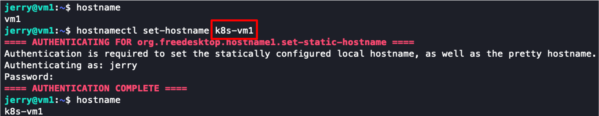

---

## Step 2：確認 VM IP

```bash
hostname -I
```

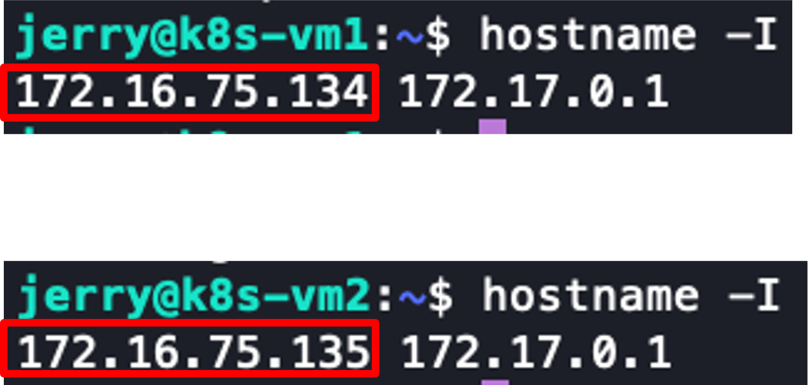

---

## Step 3：DNS 設定（All Node）

編輯 `/etc/hosts`，加入所有節點的 IP 與 hostname 對應：

```bash
sudo vi /etc/hosts
```

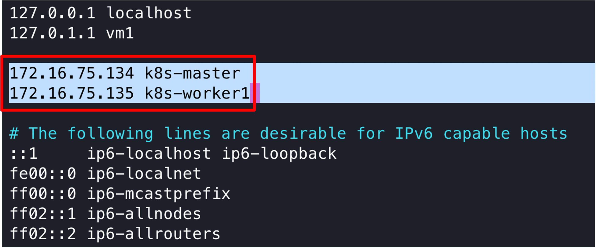

---

## Step 4：關閉 Swap（All Node）

```bash
sudo swapoff -a
free -h
```

註解掉 `/etc/fstab` 中的 swap 設定，使其重開機後不會再啟用：

```bash
sudo sed -i '/^\/swap.img/ s/^/# /' /etc/fstab
```

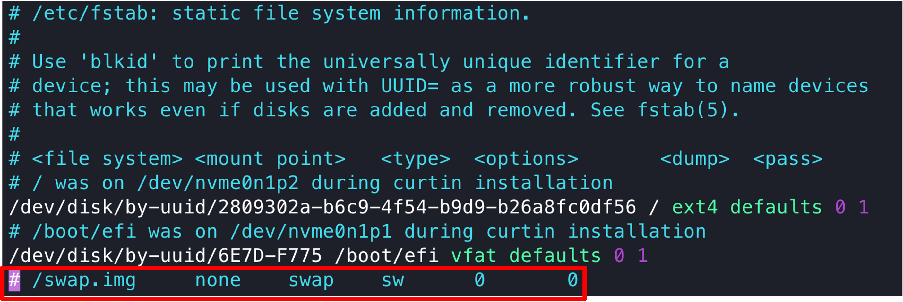

---

## Step 5：安裝必要套件（All Node）

### 5.1 安裝基礎套件與 Docker GPG Key

```bash
sudo apt-get update
sudo apt-get install -y ca-certificates curl apt-transport-https
sudo install -m 0755 -d /etc/apt/keyrings

sudo curl -fsSL https://download.docker.com/linux/ubuntu/gpg -o /etc/apt/keyrings/docker.asc
sudo chmod a+r /etc/apt/keyrings/docker.asc

echo \
  "deb [arch=$(dpkg --print-architecture) signed-by=/etc/apt/keyrings/docker.asc] https://download.docker.com/linux/ubuntu \
  $(. /etc/os-release && echo "$VERSION_CODENAME") stable" | \
  sudo tee /etc/apt/sources.list.d/docker.list > /dev/null
```


### 5.2 安裝 Docker Engine

```bash
sudo apt-get update
sudo apt-get install -y docker-ce docker-ce-cli containerd.io docker-buildx-plugin docker-compose-plugin
```

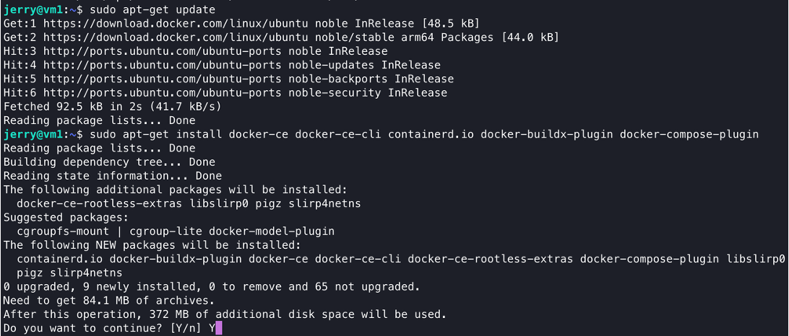

---

## Step 6：Kernel 參數設定（All Node）

### 6.1 載入必要核心模組

```bash
sudo tee /etc/modules-load.d/k8s.conf<<EOF
overlay
br_netfilter
EOF

sudo modprobe overlay
sudo modprobe br_netfilter
```

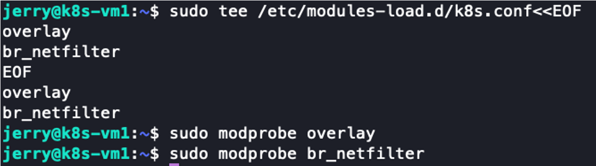

### 6.2 設定網路參數

```bash
sudo tee /etc/sysctl.d/k8s.conf<<EOF
net.bridge.bridge-nf-call-ip6tables = 1
net.bridge.bridge-nf-call-iptables = 1
net.ipv4.ip_forward = 1
EOF

sudo sysctl --system
```

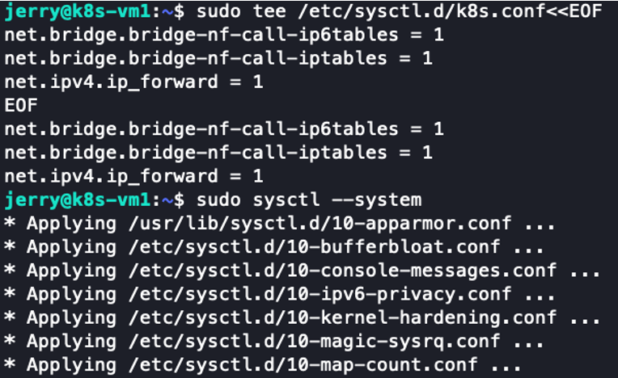

---

## Step 7：安裝 Kubernetes 套件（All Node）

### 7.1 新增 Kubernetes apt repository

```bash
curl -fsSL https://pkgs.k8s.io/core:/stable:/v1.34/deb/Release.key | sudo gpg --dearmor -o /etc/apt/keyrings/kubernetes-apt-keyring.gpg

echo 'deb [signed-by=/etc/apt/keyrings/kubernetes-apt-keyring.gpg] https://pkgs.k8s.io/core:/stable:/v1.34/deb/ /' | sudo tee /etc/apt/sources.list.d/kubernetes.list
```

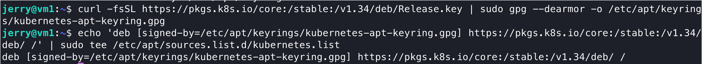

### 7.2 安裝 kubelet、kubeadm、kubectl

```bash
sudo apt-get update
sudo apt install -y kubelet kubeadm kubectl
```

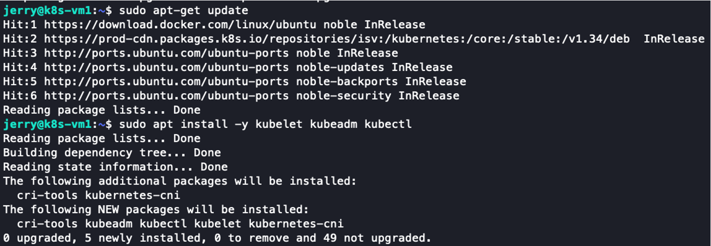

### 7.3 鎖定版本（避免自動升級）

```bash
sudo apt-mark hold kubelet kubeadm kubectl
```

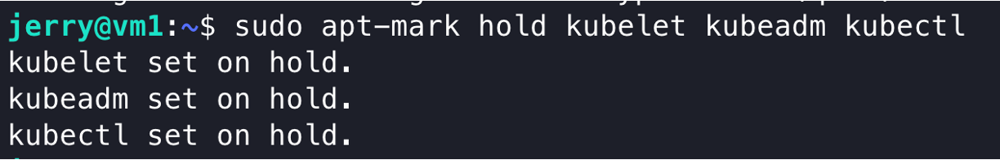

---

## Step 8：設定 Containerd（All Node）


```bash
sudo sh -c "containerd config default > /etc/containerd/config.toml"
sudo sed -i 's/ SystemdCgroup = false/ SystemdCgroup = true/' /etc/containerd/config.toml
```

重啟服務：

```bash
sudo systemctl restart containerd
sudo systemctl restart kubelet
```


---

## Step 9：初始化 Cluster（Master Node）

### 9.1 拉取映像檔並初始化

```bash
sudo kubeadm config images pull
sudo kubeadm init --pod-network-cidr=10.244.0.0/16
```

> **Checkpoint**：確認初始化成功，並記下 `kubeadm join` 指令的輸出。

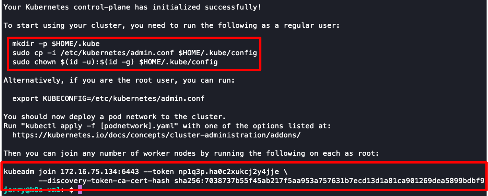

### 9.2 設定 kubeconfig

```bash
mkdir -p $HOME/.kube
sudo cp -i /etc/kubernetes/admin.conf $HOME/.kube/config
sudo chown $(id -u):$(id -g) $HOME/.kube/config
```

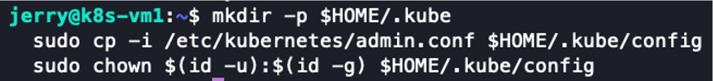

---

## Step 10：Worker Node 加入 Cluster（Worker Node）

使用 Master 初始化時輸出的 join 指令：

```bash
sudo kubeadm join 172.16.xx.xx:6443 --token XXXXXXX \
  --discovery-token-ca-cert-hash sha256:XXXXXXXXX
```

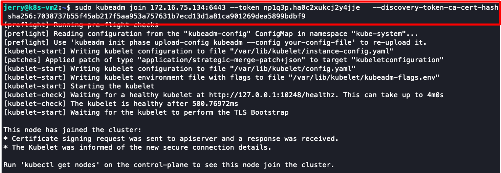

---

## Step 11：驗證節點狀態

```bash
kubectl get node
kubectl get pods -A
```

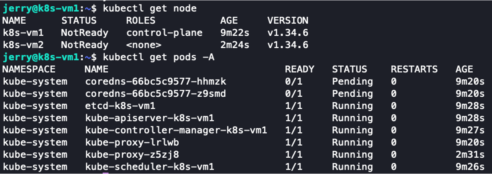

---

## Step 12：安裝 CNI Plugin（Master Node）

```bash
kubectl apply -f https://raw.githubusercontent.com/projectcalico/calico/master/manifests/calico.yaml
```

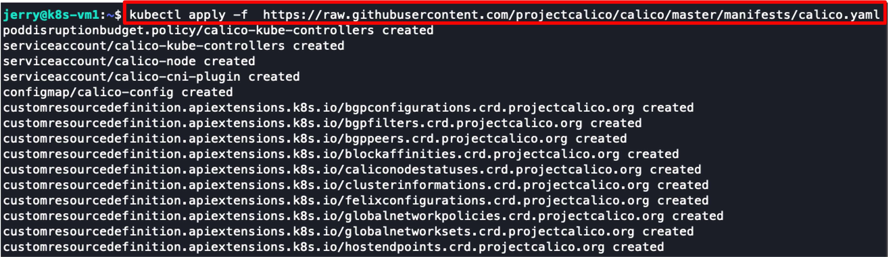

安裝後再次確認狀態：

```bash
kubectl get node
kubectl get pods -A
```

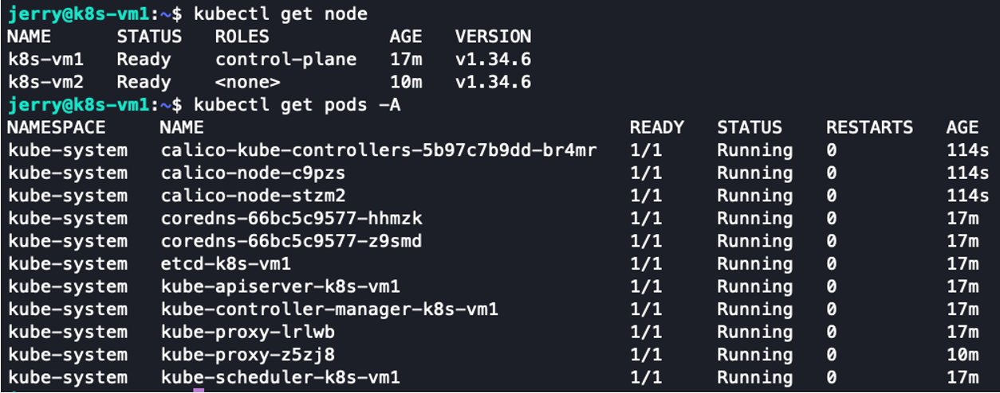

> **Checkpoint**：所有節點應顯示 `Ready`，所有 Pod 應為 `Running`。

---

## Demo：建立一個 Pod

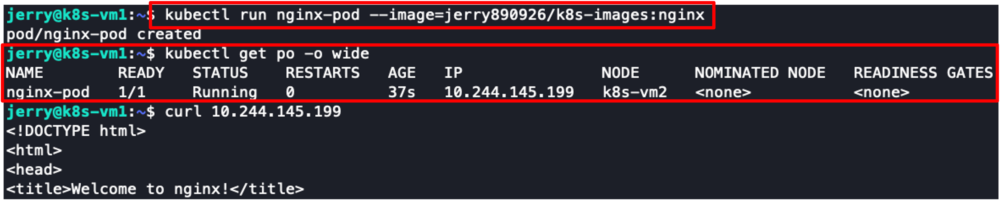

### 作業 (HW)

參考 Docker 安裝流程，完成以下步驟：

1. 撰寫 Dockerfile
2. Build image
3. Push image 到 Docker Hub
4. 部署 Pod

```bash
kubectl run <pod-name> --image=<docker-hub-repo>:<tag>
```

**Dockerfile 範例：**

```dockerfile
FROM ubuntu:24.04
RUN apt-get update && apt-get install -y apache2
EXPOSE 80
RUN echo "<h1>學號 from k8s-pod</h1>" > /var/www/html/index.html
CMD ["apache2ctl", "-D", "FOREGROUND"]
```

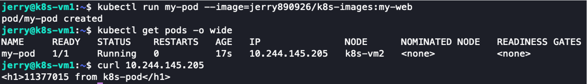

> **Checkpoint**：確認 Pod 成功運行。
