# Lab2 Service

---

## Build image

```bash
cd web
docker build -t k8slab:lab2 .
docker tag k8slab:lab2 {repo}:lab2
docker push {repo}:lab2
```

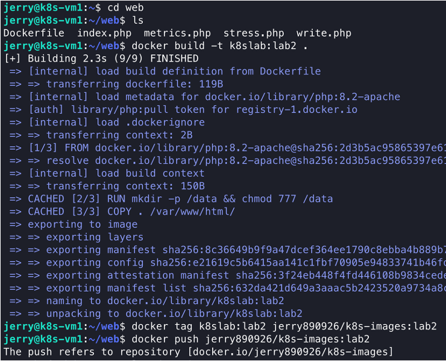

---

## 部署 Deployment

```bash
cd ~
mkdir lab2
cd lab2
```

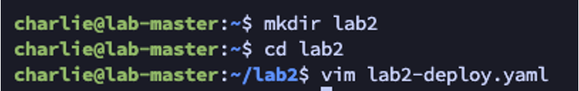

vim [lab2-deploy.yaml](yaml/lab2-deploy.yaml)：

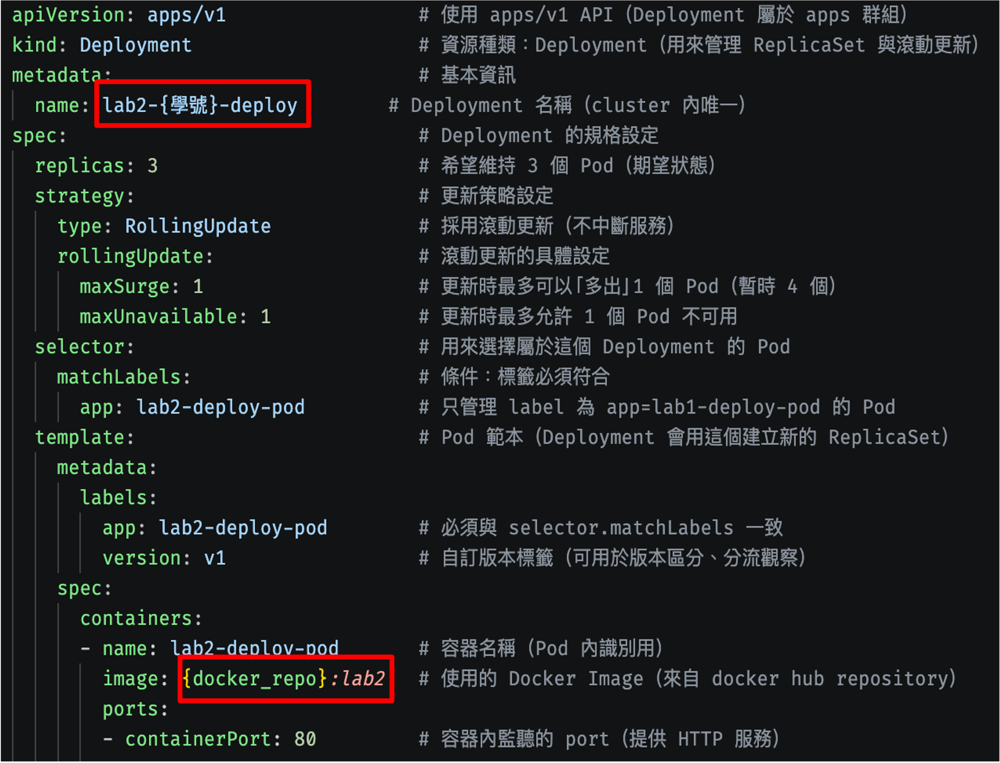

---

## Service

- ClusterIP
- NodePort
- LoadBalancer

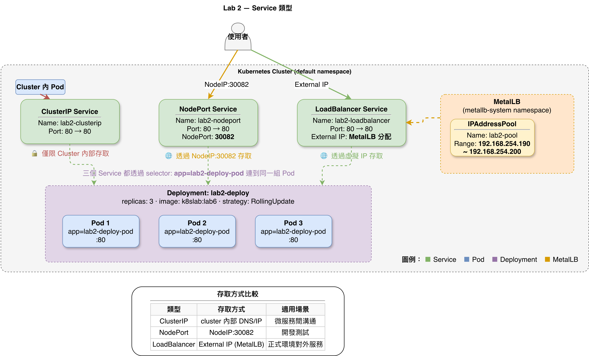

---

## 部署 ClusterIP

vim [lab2-svc-clusterip.yaml](yaml/lab2-svc-clusterip.yaml)：

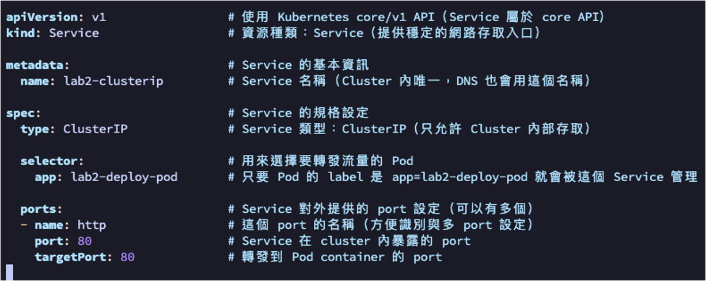

```bash
kubectl apply –f lab2-deploy.yaml
kubectl apply –f lab2-svc-clusterip.yaml
kubectl get service –o wide
kubectl get deploy –o wide
kubectl port-forward svc/lab2-clusterip 30082:80 --address 0.0.0.0
```

### Localhost web

`http://{master_ip}:30082`

回到 terminal command：

```bash
curl {serviceIP}
```

> 截圖一（需要截圖網址、有學號的 pod）

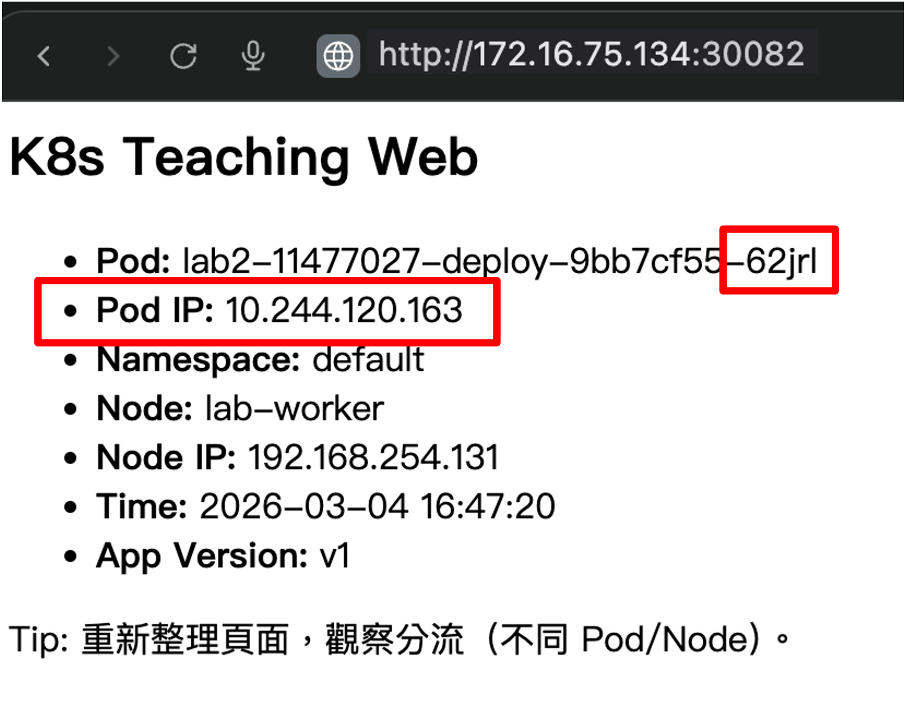

> 截圖二（需要與圖片一同樣 IP、名稱的 pod）

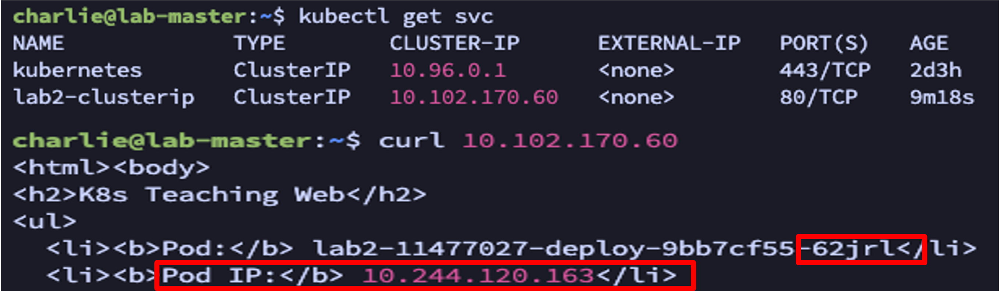

---

## 部署 NodePort

### NodePort

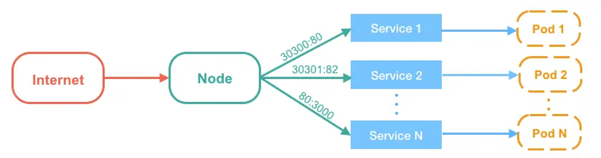

vim [lab2-svc-nodeport.yaml](yaml/lab2-svc-nodeport.yaml)：

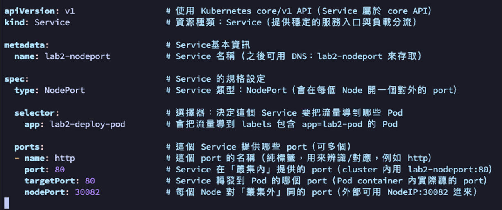

```bash
kubectl apply –f lab2-svc-nodeport.yaml
kubectl get service –o wide
curl {master_ip}:30082
```

> 截圖三（在本地端透過 master IP 的 port 進入 pod）

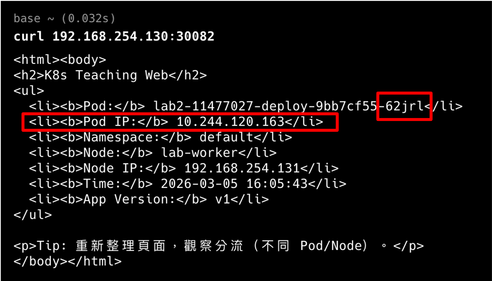

### Localhost web

`http://{master_ip}:30082`

> 截圖四（需要截圖網址、與圖三 Pod 名稱、IP 相符）

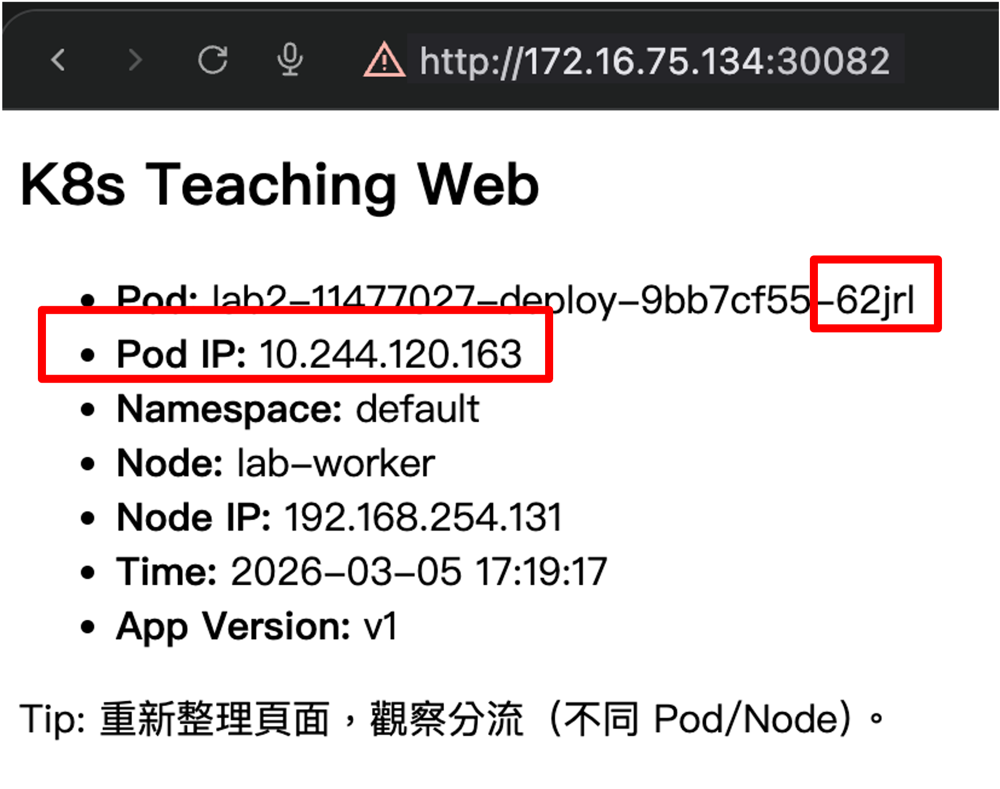

---

## 部署 LoadBalancer

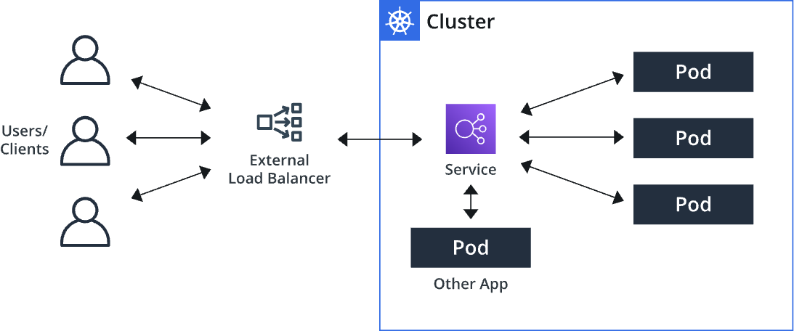

vim [lab2-svc-loadbalancer.yaml](yaml/lab2-svc-loadbalancer.yaml)：

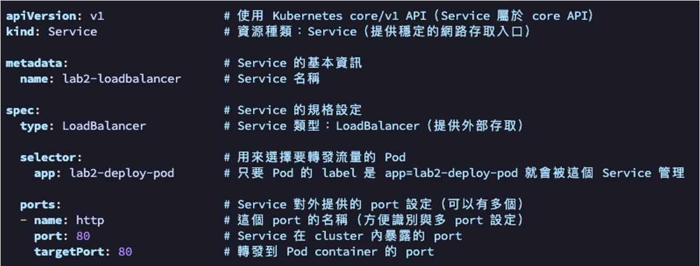

```bash
kubectl apply –f lab2-svc-loadbalancer.yaml
kubectl get service –o wide
```

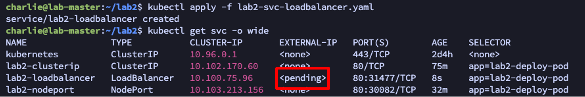

### 安裝 MetalLB

```bash
kubectl apply -f https://raw.githubusercontent.com/metallb/metallb/v0.13.12/config/manifests/metallb-native.yaml
kubectl -n metallb-system get pods -w  # 等到所有 pod 都 Running 且 READY
```

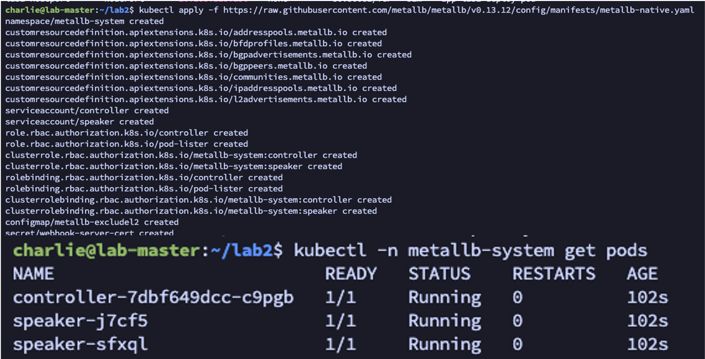

vim [lab2-metallb-pool.yaml](yaml/lab2-metallb-pool.yaml)：

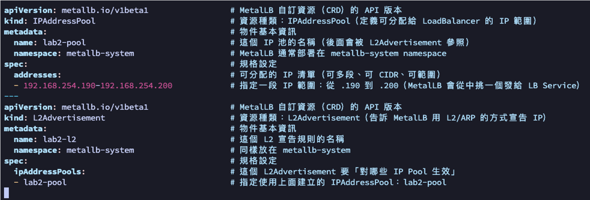

```bash
kubectl apply –f lab2-metallb-pool.yaml
kubectl get service –o wide
```

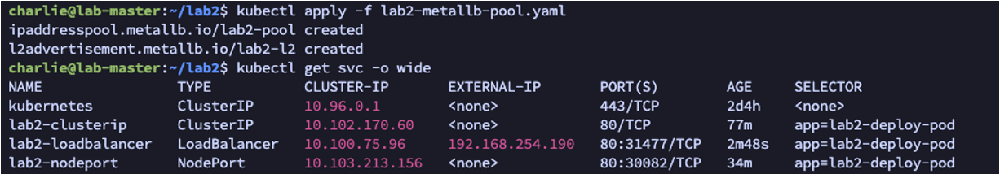

### Localhost web

`http://{EXTERNAL-IP}`

```bash
curl {EXTERNAL-IP}
```

> 截圖五（開啟瀏覽器連線 EXTERNAL IP）

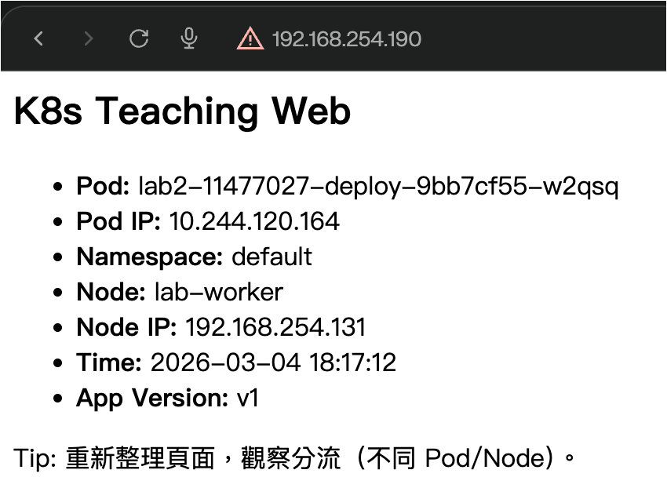

> 截圖六（開啟本地 terminal 獲取 pod 資訊）

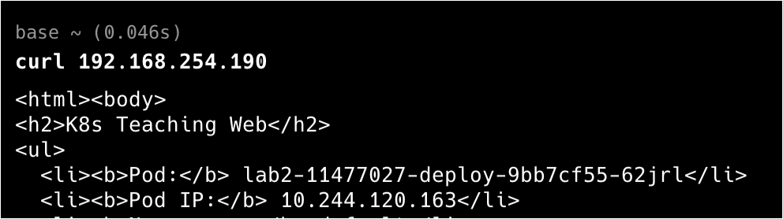
