# Lab5 HPA
---

## 一、Build image

### 1. 修改 [`index.php`](index.php)

接續之前的檔案，將 Lab3 的內容註解或刪除，於下方新增 Lab5 的內容。

```bash
cd web
vim index.php
```

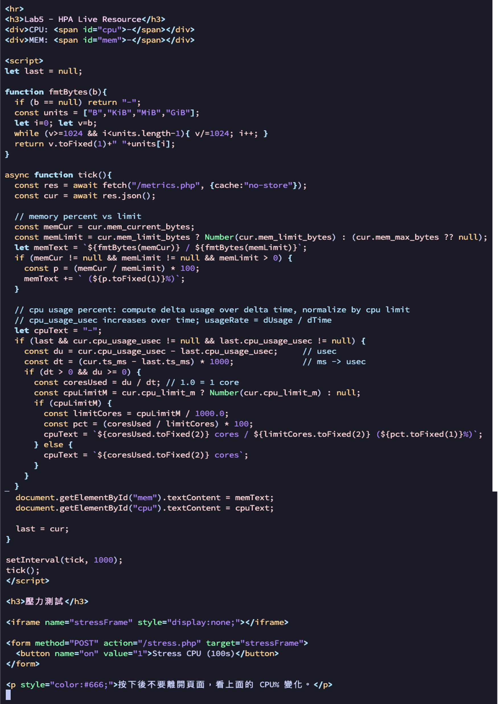

### 2. Build & Push image

```bash
docker build -t k8slab:lab5 .
docker tag k8slab:lab5 {repo}:lab5
docker push {repo}:lab5
```

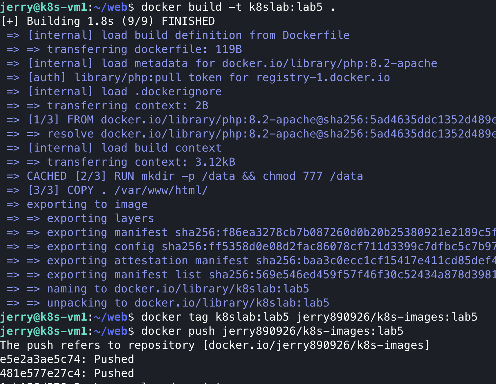

---

## 二、部署 Deployment / Service

### 1. 建立工作目錄並撰寫 YAML

```bash
mkdir lab5
cd lab5
vim lab5-deploy.yaml
vim lab5-svc.yaml

kubectl apply -f lab5-deploy.yaml
kubectl apply -f lab5-svc.yaml
```

對應的 YAML 檔案：

- [`lab5-deploy.yaml`](yaml/lab5-deploy.yaml)（含 Namespace、resources requests/limits、CPU/MEM 環境變數）
- [`lab5-svc.yaml`](yaml/lab5-svc.yaml)（NodePort 30085）

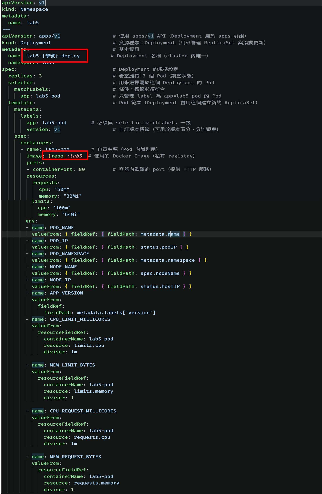

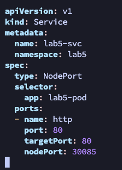

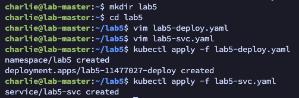

---

## 三、安裝 Metrics Server

HPA 需要 metrics-server 才能取得 Pod 的 CPU/Memory 使用量。

```bash
kubectl apply -f https://github.com/kubernetes-sigs/metrics-server/releases/latest/download/components.yaml

kubectl -n kube-system edit deployment metrics-server  # 修改設定

kubectl -n kube-system get pods | grep metrics  # 等 pod running 再進行下一步

kubectl top nodes
```

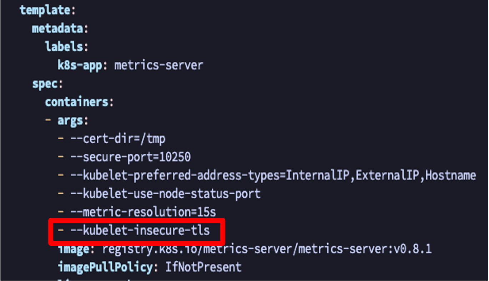
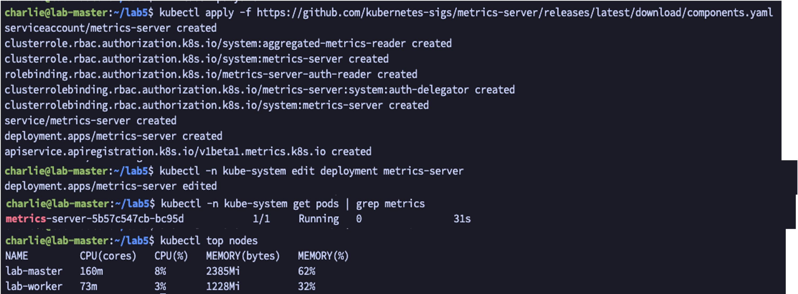

---

## 四、部署 HPA

```bash
vim lab5-hpa.yaml

kubectl apply -f lab5-hpa.yaml
kubectl get hpa -n lab5   # 確認有偵測到
```

對應的 YAML 檔案：[`lab5-hpa.yaml`](yaml/lab5-hpa.yaml)
（CPU 平均使用率 > 50% 時擴展，min=1、max=5）

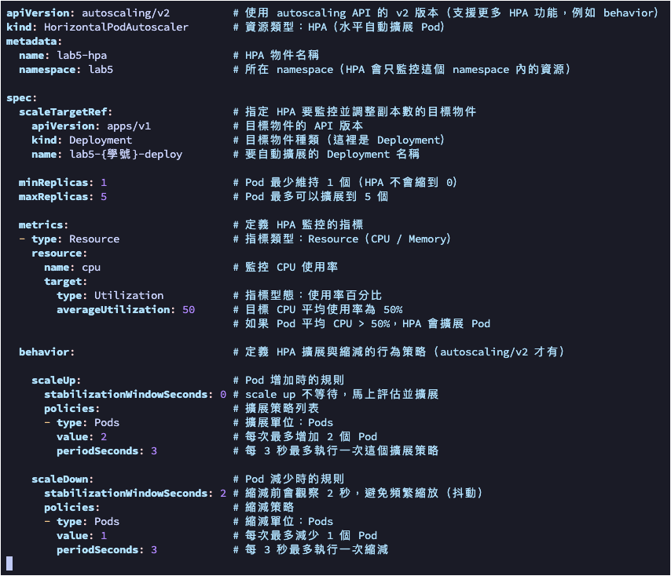
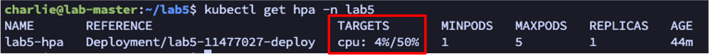

---

## 五、HPA 壓力測試

### 1. 開啟兩個 Terminal 觀察

```bash
# Terminal A：觀察 HPA 指標
kubectl get hpa -n lab5 -w

# Terminal B：觀察 Pod 數量變化
kubectl get pod -n lab5 -w
```

### 2. 瀏覽器存取並觸發壓力測試

```
http://{masterip}:30085
```

按下頁面上的 **Stress CPU (100s)** 按鈕，觀察 CPU% 飆高與 HPA 擴展行為。

> **截圖一**：web 按下壓力測試按鈕、CPU 飆高
> **截圖二**：HPA scale 到 5 再慢慢降到 1

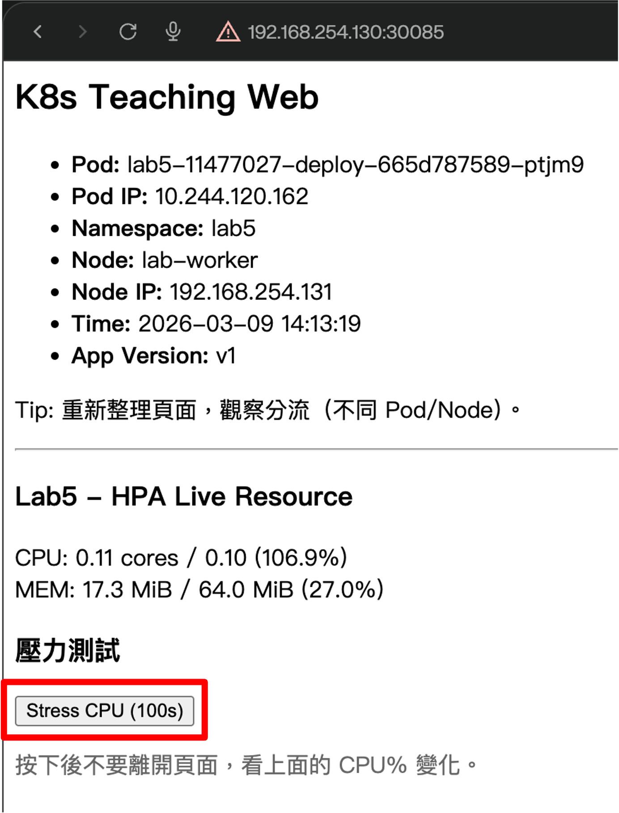
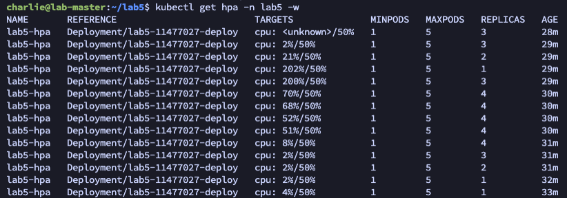

